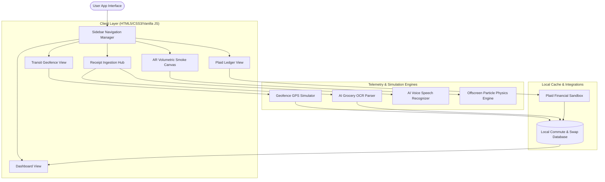

# Eco-Companion: Personal Carbon Footprint Tracker

A personal carbon footprint tracking platform that helps users monitor environmental impact through automated commute tracking, AI-powered receipt analysis, sustainability recommendations, and interactive carbon visualization tools.

Live Demo: https://roma2020-app.github.io/carbontrackerByRoma/

GitHub: https://github.com/roma2020-app/carbontrackerByRoma

---
# Project Summary

Eco-Companion: Personal Carbon Footprint Tracker is a climate-tech web application that helps users understand, track, and reduce their personal carbon footprint through intelligent automation. The platform minimizes manual data entry by combining commute tracking, carbon impact calculations, AI-powered receipt analysis, and sustainability insights. Users can monitor daily environmental impact, receive personalized recommendations, visualize emissions, and participate in eco-friendly challenges to encourage sustainable behavior. The solution aims to bridge the gap between carbon awareness and actionable lifestyle changes through an engaging and data-driven experience.

## Key Features

- **Automated Geofenced Commute Tracking:** Passive velocity-based transport classifier transitions from stationary to moving states and calculates driving, walking, or cycling footprints automatically.
- **Plaid Bank Utilities Sync:** Integrates mock sandbox bank credit cards to map electric grid emissions and recurring fuel bills.
- **AI-Powered OCR Grocery Swapper:** Upload supermarket receipt images or speak ingredients aloud to calculate supply-chain lifecycle footprints and get directed to specific in-store aisles for sustainable alternatives.
- **AR Spatial Smoke Viewer:** Renders volumetric greenhouse gas emissions (red smoke) and offsets (green smoke) in 3D AR space using HTML5 canvas performance.
- **Group Challenges & Leaderboard:** Engage in social sustainability metrics and ranks with friends and coworkers.
- **Predictive AI Insights & Forecasts:** Simulates monthly trajectory savings dynamically.

---

## Screenshots

Here are the key visual interfaces of CarbonTrackerByRoma:

<p align="center">
  
  
</p>
<p align="center">
  
  
</p>

---


### Problem
Most carbon trackers fail because logging daily actions manually (commutes, flights, meals) is a heavy administrative burden, leading to rapid user churn. Furthermore, abstract metrics like "10kg CO₂" fail to inspire behavioral modification due to psychological distance, and users lack localized directions to execute swaps.

### The Solution: Eco-Companion
Eco-Companion bridges the "Action Gap" by automating personal footprint telemetry across three primary life areas:
1. **Passive Geofenced Commuting:** Background speed telemetry automatically classifies walking, cycling, and driving commutes when device speed thresholds are triggered.
2. **Transaction-Linked Calculations:** Credit card utility billing ledger updates are synced automatically using a financial sandbox (simulated Plaid integration), mapping recurring utility bills and fuel fill-ups to regional greenhouse gas factors.
3. **AI OCR Grocery Swapping:** Multi-modal receipt parsing scans supermarket bills, extracts ingredients, estimates supply-chain footprints, and routes the user to the exact local store shelf and aisle where lower-carbon plant-based alternatives are stocked.
4. **AR Atmosphere Visualizer:** Projects volumetric colored particles inside a room mapping emissions (red smoke) and green offsets (green smoke), turning abstract weight numbers into physical volume metrics.

---

## How this solves the problem

Eco-Companion: Personal Carbon Footprint Tracker helps users:
- Understand their carbon footprint
- Track daily activities
- Receive personalized reduction tips
- Monitor progress over time

## Product Architecture

The system utilizes a client-first HTML5/CSS3/JS framework coupled with offscreen physics render caching and regional lifecycle calculations:



---

## 2. Approach & Logic

- **Geofence Classifier Logic:** Transitions from *Stationary* to *Moving* commute tracking when speed exceeds **5 km/h**. Distance is integrated over time, and transport modes are automatically classified (*Walking* under 15 km/h, *Cycling* under 28 km/h, and *Driving* above 28 km/h).
- **Utility Ledger Logic:** Parses merchant tags (e.g., Duke Energy) to compute carbon equivalents based on the regional electric grid emission factor.
- **Supply-Chain Footprint logic:** Uses standard lifecycle greenhouse gas factor definitions (e.g., ribeye steak at **31 kg CO₂/kg** vs. plant meat at **1.2 kg CO₂/kg**).

---


---

## 3. Installation Steps

1. **Clone the Repository:**
   ```bash
   git clone https://github.com/roma2020-app/carbontrackerByRoma.git
   cd carbon-tracker
   ```
2. **Install Node.js Dependencies (Required for automated tests):**
   Ensure Node.js is installed. Run:
   ```bash
   npm install
   ```
3. **Start Development Server:**
   Launch the lightweight local development server:
   ```bash
   npm start
   ```
   *Alternatively*, you can run Python's built-in HTTP server:
   ```bash
   python -m http.server 8080
   ```
4. **Access the App:**
   Running locally by:
   Open your browser and navigate to **[http://localhost:8080](http://localhost:8080)**.

Live Demo: https://roma2020-app.github.io/carbontrackerByRoma/
---

## 5. Running Automated Unit Tests

No external NPM installs or testing frameworks (like Jest/Mocha) are required. The project relies on Node's native lightweight test runner:

```bash
# Execute unit testing suite
npm test
```
The console will report test coverage for speed limits, carbon multiplier values, grocery alternatives savings, and forecasting models.

---

## Future Enhancements

- **Real Plaid Link Integration:** Connect real credit card statement transaction feeds.
- **WebRTC Native Camera AR:** Replace canvas particle overlays with actual rear-camera video mapping.
- **Continuous GPS Tracking Background Service:** Build Native Android and iOS bindings for persistent geolocation logging.
- **Deep Learning OCR models:** Move from regex-matching presets to server-side image-to-text parsers (Tesseract.js).
- **Gamified Rewards Exchange:** Introduce redeemable sustainability coupons from partner green merchants.
