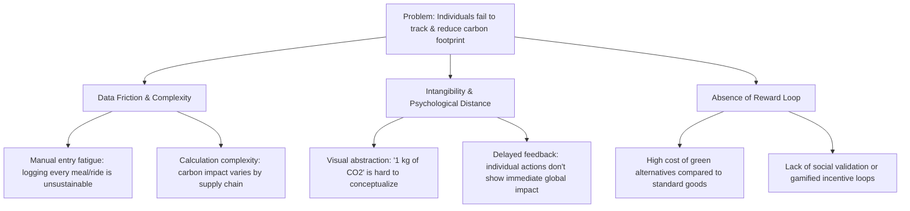
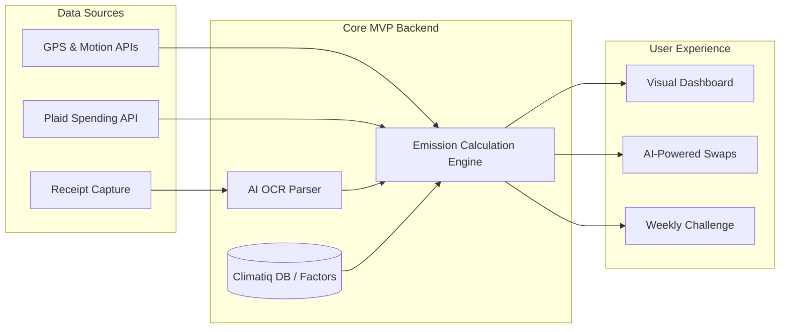

# Product Architecture & Analysis: Carbon Footprint Awareness Platform

This document outlines the strategic product design, stakeholder analysis, architectural considerations, and roadmap for a comprehensive Carbon Footprint Awareness Platform aimed at driving individual climate action.

---

## 1. Stakeholders

A successful ecosystem requires aligning incentives across multiple stakeholder groups:

*   **Primary Consumers (End Users):** Individuals tracking and reducing their personal footprints to meet personal ethical goals or participate in community challenges.
*   **Platform Operators & Developers:** Maintain the application, curate the carbon emission factor database, and negotiate partnership deals.
*   **Corporate Partners / Sponsors:** Businesses seeking to sponsor green challenges, advertise eco-friendly products, or integrate the platform into corporate wellness/ESG programs.
*   **Environmental NGOs & Verification Bodies:** Validate the carbon offset projects offered, verify methodologies, and provide scientific backing for emission factors.
*   **Carbon Offset Providers:** Supply the verified carbon credits (e.g., Gold Standard, Verra) that users can purchase to offset unavoidable emissions.
*   **Municipalities / Local Governments:** Interested in localized aggregate, anonymized emission trends to inform city planning and municipal sustainability initiatives.

---

## 2. User Personas

To ensure the platform appeals to diverse motivations, we define three key user personas:

### Persona A: "The Eco-Conscious Novice" (Roma, 26)
*   **Bio:** A marketing associate who cares deeply about the environment but is overwhelmed by the scientific complexity of climate action.
*   **Needs:** Easy-to-understand metrics, guided and low-friction habit recommendations, and positive reinforcement.
*   **Pain Points:** Finds manual data entry exhausting; doesn't know if swapping dairy for oat milk actually makes a measurable impact.

### Persona B: "The Data-Driven Optimizer" (Alex, 34)
*   **Bio:** A software engineer who loves quant-self tracking (e.g., smart watches, budget apps) and smart home automation.
*   **Needs:** Automated data integrations (API connection to utility bills, smart meters, and transport), granular charts, and advanced breakdowns of historical trends.
*   **Pain Points:** Frustrated by "black-box" calculations and overly generic regional averages.

### Persona C: "The Busy Parent" (Marcus, 42)
*   **Bio:** A busy manager balancing work and raising two kids. Wants to build sustainable family habits but has extremely limited free time.
*   **Needs:** Passive tracking, quick-win recommendations that also save household utility costs, and family-friendly gamification.
*   **Pain Points:** Refuses to manually log daily commutes or scan every grocery receipt.

---

## 3. Root Cause Analysis

Before designing solutions, we must analyze why individuals struggle to track and reduce their carbon footprint. The diagram below illustrates the root causes:



---

## 4. Existing Solutions

Currently, the market addresses this problem through three main categories:

1.  **Static Carbon Calculators (e.g., WWF Footprint Calculator, Global Footprint Network):**
    *   *Approach:* Annual or one-time questionnaires asking about household energy, diet, and flights to estimate an annual footprint.
2.  **Gamified Green Apps (e.g., JouleBug, Earth Hero):**
    *   *Approach:* Focus on daily check-ins, educational quizzes, and gamified checklists of sustainable habits.
3.  **B2B / B2B2C Corporate ESG Platforms (e.g., Greenly, Watershed, Deed):**
    *   *Approach:* Corporate platforms that track employee travel, commutes, and office energy, sometimes featuring employee engagement portals.

---

## 5. Gaps in Existing Solutions

*   **Excessive Friction (The Logging Problem):** Static calculators provide a single retrospective estimate rather than active tracking. Gamified apps rely on heavy manual entry, leading to a typical churn rate within 2 to 3 weeks.
*   **Lack of Personalization:** Many apps use static regional averages (e.g., "average US citizen's grid emission factor") which do not reflect an individual's actual switch to solar energy or public transit.
*   **Invisible Progress:** Displaying progress as abstract weight metrics (e.g., "0.04 tonnes of CO2 saved") does not connect with users' daily lives, failing to create a strong psychological reward.
*   **High Carbon Swapping Barriers:** Highlighting that a user has a high-carbon diet without showing nearby grocery stores with sustainable alternatives or local cost savings keeps the solution purely diagnostic rather than actionable.

---

## 6. 10 Possible Solutions

To solve the gaps, we propose ten distinct, creative solutions:

1.  **Transaction-Linked Automated Tracker:** Connects to bank accounts (via secure APIs like Plaid) to automatically estimate carbon emissions based on merchant categories and purchase values (e.g., gas stations, airline tickets, utility bills).
2.  **Autonomous Smart Transit Logger:** Uses background mobile location APIs and physical activity transition libraries to auto-detect transportation modes (train, bicycle, car, foot) and calculate daily commute emissions without manual logging.
3.  **Utility Smart Meter Integrator:** Connects directly with local power grid APIs and smart home thermostats to track real-time electricity/gas usage and nudge users to shift high-energy tasks to low-carbon grid hours.
4.  **AI OCR Receipt & Grocery Scanner:** An LLM-powered camera tool that parses supermarket receipts, identifies specific food items, estimates their supply-chain emissions, and recommends local, lower-footprint ingredient swaps.
5.  **E-Commerce "Carbon Checkout" Chrome Extension:** Integrates into online shopping platforms, displaying the lifecycle carbon cost of items alongside standard prices, offering green alternative suggestions, and supporting micro-offsets.
6.  **Social Team Leagues & Gamified Challenges:** Group-based tournaments (families, workplaces, neighborhoods) with real-time leaderboards, group goals, and tangible, sponsor-funded rewards for the highest carbon reductions.
7.  **Decentralized Green Rewards Program:** Earn tokenized "Eco-Points" for real emission reductions, redeemable for discounts at certified sustainable partner merchants or converted into municipal tax credits.
8.  **Conversational AI Eco-Coach:** A natural-language interface that answers questions (e.g., *"How can I lower my heating bill?"*), tracks user goals, and lets users log irregular events via voice chat.
9.  **Embedded Micro-Offsetting Marketplace:** A fractional offsetting tool allowing users to offset specific micro-actions (e.g., a coffee run, a movie ticket) for pennies with transparent, GPS-mapped, verified local forestry or soil carbon projects.
10. **Augmented Reality (AR) Carbon Visualizer:** Uses AR to project virtual "smoke clouds" or "forest blocks" in a user's physical space, translating abstract metrics (e.g., 5kg of CO2) into tangible spatial volumes.

---

## 7. Select Best Solution

### Selected Approach: **The Automated Eco-Companion**
We select a hybrid platform combining **Autonomous Smart Transit Logging (Solution 2)**, **Transaction-Linked Automated Carbon Estimation (Solution 1)**, and **AI OCR Receipt Scanning (Solution 4)**.

#### Rationale:
*   **Solves Root Cause #1 (Friction):** By automating transit detection and utility/spending estimation, we eliminate manual data entry, the primary driver of user churn.
*   **High Personalization:** Rather than using national averages, the app reads the user's specific utility data, actual flight purchases, and transit routes.
*   **Actionable & Contextual:** The AI receipt scanner provides direct shopping alternatives, converting awareness into concrete habit modification.

---

## 8. MVP Scope

The Minimum Viable Product (MVP) will focus on delivering a high-impact, low-friction tracking experience for mobile users.



### Key Features
1.  **No-Friction Transit Tracking:** Run background motion services to capture and classify daily travel (Walking, Cycling, Driving, Transit) and display the resulting commute footprint.
2.  **Automated Spending Ingestion:** Integrate a secure sandbox Plaid connection to categorize recurring utility payments and transport purchases into carbon estimates using standard greenhouse gas protocol factors.
3.  **AI Receipt Scanning:** Allow users to snap photos of grocery receipts. The backend parses items using an LLM API and provides a simple carbon rating (Low/Medium/High) along with 3 smart ingredient swaps.
4.  **Tangible Metric Visualizations:** Replace weight metrics with relatable comparisons (e.g., "Your savings this week equals planting 3 virtual trees").
5.  **One Weekly Peer Challenge:** A simple leaderboard allowing users to invite up to 5 friends or family members to compete in a weekly "Commute Green" or "Plant-Based Week" challenge.

### Technical Stack
*   **Frontend:** React Native / Expo (enables cross-platform iOS/Android development with access to native background geofencing and motion detection APIs).
*   **Backend:** Node.js with Fastify, hosted on a serverless platform (e.g., Google Cloud Run) for rapid scaling.
*   **Database:** PostgreSQL (user accounts, tracked actions, and challenge leaderboards) paired with Redis for rapid geofencing updates.
*   **Carbon Calculations:** Integration with the **Climatiq API** or similar open-source databases (e.g., Mobitool, DEFRA) to fetch verified, region-specific emission factor metrics.
*   **Receipt Parsing:** Lightweight prompt utilizing OpenAI GPT-4o-mini to convert image OCR text into structured JSON lists of food items with estimated footprints.

---

## 9. Innovation Opportunities

*   **Grid-Aware Charging Automation:** Expand smart-home integrations to automatically toggle EV charging, smart plugs, or smart appliances to run during periods when grid energy is cleanest (highest solar/wind generation mix).
*   **Zero-Knowledge Green Proofs:** Utilize cryptographic Zero-Knowledge Proofs (ZKPs) to let users prove their low-carbon achievements to employers or municipalities without exposing their raw GPS history, purchase logs, or private data.
*   **Hyper-Local Impact Mapping:** Connect micro-offset purchases with real-time IoT sensors placed at local restoration sites. Let users see live photos, canopy growth data, or soil moisture readings from the exact forest acre they helped fund.

---

## 10. Future Roadmap

```
+-------------------------------------------------------------------+
|                            ROADMAP                                |
+-------------------------------------------------------------------+
|  PHASE 1: Core Automation (Months 1-4)                             |
|  * Launch iOS/Android MVP with Plaid & Motion API auto-tracking   |
|  * Introduce basic AI Receipt Scanner                             |
|  * Implement core gamification (Weekly Friends Challenge)          |
+-------------------------------------------------------------------+
                                  |
                                  v
+-------------------------------------------------------------------+
|  PHASE 2: Ecosystem Integration (Months 5-9)                      |
|  * Build direct Smart Home & Smart Meter API integrations         |
|  * Launch browser extension to flag carbon during e-commerce      |
|  * Roll out verified Micro-Offset marketplace                     |
+-------------------------------------------------------------------+
                                  |
                                  v
+-------------------------------------------------------------------+
|  PHASE 3: Scale & B2B Expansion (Months 10-14)                    |
|  * Launch "Eco-Companion for Teams" B2B B2B2C corporate portal    |
|  * Develop city-wide green incentive partnerships with local gov  |
|  * Introduce offline retail integrations (loyalty card linkages)  |
+-------------------------------------------------------------------+
```
