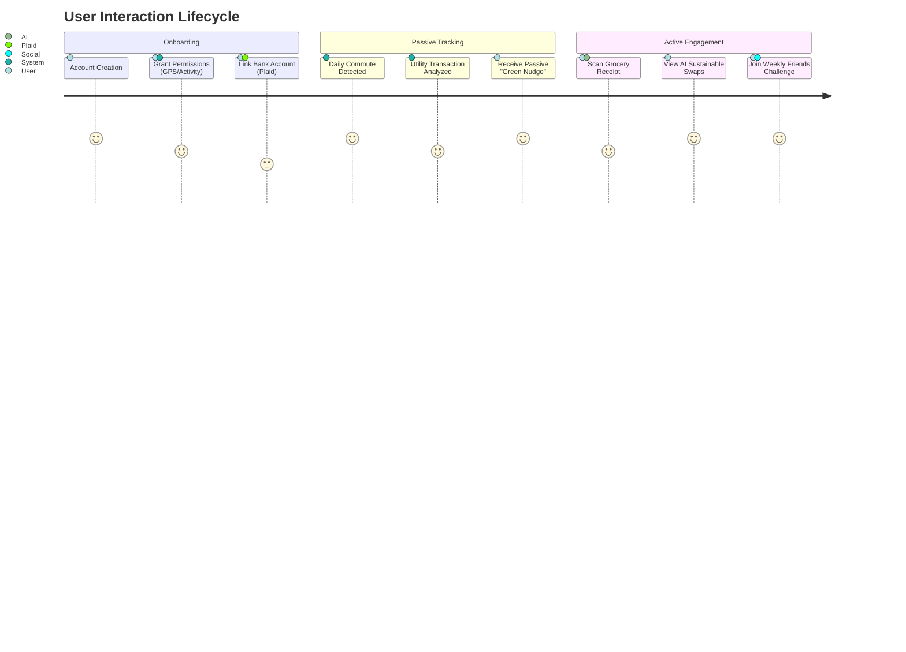
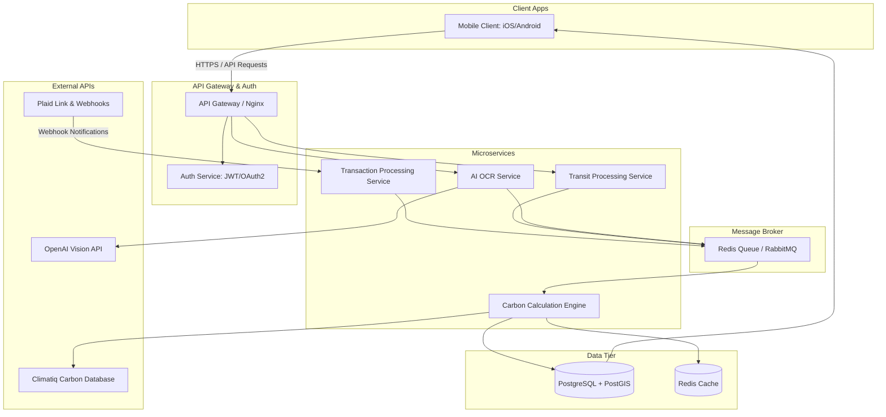

# System Architecture: The Automated Eco-Companion

This document details the software architecture, system integrations, database design, and API contracts for the **Automated Eco-Companion** platform.

---

## 1. User Journey



---

## 2. Core Features

1.  **Autonomous Commute Classifier:** Utilizes device accelerometer, gyroscope, and GPS tracking to classify transit modes in the background (Walking, Running, Cycling, Driving, Transit) and logs distance.
2.  **Transaction Carbon Estimator:** Listens for financial transaction webhooks from Plaid, parses merchant IDs, matches them with industrial carbon intensity factors, and logs estimates.
3.  **AI OCR Receipt Swapper:** Allows taking photos of printed grocery receipts, uses OCR and LLM matching to extract items, looks up their environmental footprints, and recommends lower-carbon alternatives.
4.  **Community Challenge Engine:** Powers weekly leaderboards and cooperative/competitive group targets for carbon savings.
5.  **Dynamic Nudging Service:** Generates daily micro-habit tips based on detected behaviors (e.g., *"You drove to work today, but the train would have saved 3.5kg of CO2. Tap here to see train schedules."*).

---

## 3. Application Flow

The diagram below details the ingestion, processing, and visualization pathways:



---

## 4. Database Schema

A relational schema (PostgreSQL) optimized for temporal and spatial logs.

```sql
-- Core User Profiles
CREATE TABLE users (
    id UUID PRIMARY KEY DEFAULT gen_random_uuid(),
    email VARCHAR(255) UNIQUE NOT NULL,
    password_hash VARCHAR(255) NOT NULL,
    created_at TIMESTAMP WITH TIME ZONE DEFAULT CURRENT_TIMESTAMP,
    updated_at TIMESTAMP WITH TIME ZONE DEFAULT CURRENT_TIMESTAMP
);

-- Plaid Link Accounts
CREATE TABLE bank_accounts (
    id UUID PRIMARY KEY DEFAULT gen_random_uuid(),
    user_id UUID REFERENCES users(id) ON DELETE CASCADE,
    plaid_item_id VARCHAR(255) UNIQUE NOT NULL,
    plaid_access_token VARCHAR(255) NOT NULL,
    institution_name VARCHAR(100),
    status VARCHAR(50) DEFAULT 'ACTIVE',
    created_at TIMESTAMP WITH TIME ZONE DEFAULT CURRENT_TIMESTAMP
);

-- Transaction Logs
CREATE TABLE transactions (
    id UUID PRIMARY KEY DEFAULT gen_random_uuid(),
    user_id UUID REFERENCES users(id) ON DELETE CASCADE,
    bank_account_id UUID REFERENCES bank_accounts(id) ON DELETE CASCADE,
    plaid_transaction_id VARCHAR(255) UNIQUE NOT NULL,
    amount NUMERIC(10, 2) NOT NULL,
    category VARCHAR(100),
    merchant_name VARCHAR(255),
    carbon_estimate_kg NUMERIC(8, 2),
    transaction_date DATE NOT NULL,
    processed_at TIMESTAMP WITH TIME ZONE DEFAULT CURRENT_TIMESTAMP
);

-- Background Transit Logs (Using PostGIS)
CREATE TABLE trips (
    id UUID PRIMARY KEY DEFAULT gen_random_uuid(),
    user_id UUID REFERENCES users(id) ON DELETE CASCADE,
    transit_mode VARCHAR(50) NOT NULL, -- WALKING, CYCLING, DRIVING, TRANSIT
    distance_meters NUMERIC(10, 2) NOT NULL,
    start_time TIMESTAMP WITH TIME ZONE NOT NULL,
    end_time TIMESTAMP WITH TIME ZONE NOT NULL,
    route GEOMETRY(LineString, 4326), -- Requires PostGIS extension
    carbon_estimate_kg NUMERIC(8, 2) NOT NULL,
    created_at TIMESTAMP WITH TIME ZONE DEFAULT CURRENT_TIMESTAMP
);

-- Receipt AI Scans
CREATE TABLE receipt_scans (
    id UUID PRIMARY KEY DEFAULT gen_random_uuid(),
    user_id UUID REFERENCES users(id) ON DELETE CASCADE,
    image_url VARCHAR(512) NOT NULL,
    raw_ocr_text TEXT,
    carbon_estimate_kg NUMERIC(8, 2) NOT NULL,
    created_at TIMESTAMP WITH TIME ZONE DEFAULT CURRENT_TIMESTAMP
);

CREATE TABLE receipt_items (
    id UUID PRIMARY KEY DEFAULT gen_random_uuid(),
    scan_id UUID REFERENCES receipt_scans(id) ON DELETE CASCADE,
    item_name VARCHAR(255) NOT NULL,
    quantity INT DEFAULT 1,
    carbon_estimate_kg NUMERIC(8, 2) NOT NULL,
    suggested_alternative VARCHAR(255),
    alternative_carbon_saving_kg NUMERIC(8, 2)
);

-- Challenge Engine
CREATE TABLE challenges (
    id UUID PRIMARY KEY DEFAULT gen_random_uuid(),
    title VARCHAR(100) NOT NULL,
    description TEXT,
    target_reduction_kg NUMERIC(8, 2) NOT NULL,
    start_date TIMESTAMP WITH TIME ZONE NOT NULL,
    end_date TIMESTAMP WITH TIME ZONE NOT NULL,
    created_by UUID REFERENCES users(id) ON DELETE SET NULL
);

CREATE TABLE challenge_participants (
    challenge_id UUID REFERENCES challenges(id) ON DELETE CASCADE,
    user_id UUID REFERENCES users(id) ON DELETE CASCADE,
    current_savings_kg NUMERIC(8, 2) DEFAULT 0.00,
    joined_at TIMESTAMP WITH TIME ZONE DEFAULT CURRENT_TIMESTAMP,
    PRIMARY KEY (challenge_id, user_id)
);
```

---

## 5. API Design

### 5.1 Authenticate and Register
*   **Endpoint:** `POST /api/v1/auth/register`
*   **Request:**
    ```json
    {
      "email": "user@example.com",
      "password": "secure_password_string"
    }
    ```
*   **Response (`201 Created`):**
    ```json
    {
      "user_id": "c1f77d34-7a0e-4364-8848-6d2c67ef1abf",
      "token": "eyJhbGciOiJIUzI1NiIsInR5cCI6IkpXVCJ9..."
    }
    ```

### 5.2 Submit Transit Trip (Background Sync)
*   **Endpoint:** `POST /api/v1/trips`
*   **Request:**
    ```json
    {
      "transit_mode": "DRIVING",
      "distance_meters": 12450.00,
      "start_time": "2026-06-21T08:00:00Z",
      "end_time": "2026-06-21T08:25:00Z",
      "coordinates": [
        {"lat": 40.7128, "lng": -74.0060},
        {"lat": 40.7306, "lng": -73.9352}
      ]
    }
    ```
*   **Response (`201 Created`):**
    ```json
    {
      "trip_id": "8c0a87a2-f81d-44eb-843b-4ffab57849d4",
      "carbon_estimate_kg": 2.76,
      "equivalency": "Charging 335 smartphones"
    }
    ```

### 5.3 Scan Receipt (OCR Upload)
*   **Endpoint:** `POST /api/v1/receipts/scan`
*   **Request:** `multipart/form-data` with image file upload.
*   **Response (`202 Accepted`):**
    ```json
    {
      "scan_id": "78ee4b4c-9f66-419b-b0b9-8e2cb324c4e7",
      "status": "PROCESSING",
      "estimated_wait_seconds": 3
    }
    ```

### 5.4 Fetch Scan Results
*   **Endpoint:** `GET /api/v1/receipts/scan/{scan_id}`
*   **Response (`200 OK`):**
    ```json
    {
      "scan_id": "78ee4b4c-9f66-419b-b0b9-8e2cb324c4e7",
      "status": "COMPLETED",
      "total_carbon_estimate_kg": 4.85,
      "items": [
        {
          "item_name": "Beef Ribeye Steak 500g",
          "carbon_estimate_kg": 3.80,
          "suggested_alternative": "Plant-Based Impossible Beef 500g",
          "alternative_carbon_saving_kg": 3.40
        },
        {
          "item_name": "Organic Almond Milk 1L",
          "carbon_estimate_kg": 0.40,
          "suggested_alternative": "Local Oat Milk 1L",
          "alternative_carbon_saving_kg": 0.15
        }
      ]
    }
    ```

---

## 6. Tech Stack Recommendation

| Layer | Recommended Technology | Rationale |
|---|---|---|
| **Mobile Client** | **React Native (Expo)** | Cross-platform codebase with access to native hardware trackers (`expo-location` and `expo-sensors` activity recognition). |
| **Backend Framework**| **Node.js (Fastify)** | Extremely fast JSON validation, low overhead, ideal for gateway API logic and microservices. |
| **Database** | **PostgreSQL + PostGIS** | Spatial database extension enables storing commute route geometries and measuring routes accurately. |
| **Async Broker** | **Redis** | In-memory key-value cache, handling message queues (via BullMQ) and geofencing caching. |
| **Carbon Engine** | **Climatiq API** | Industry standard, continuously updated global database containing GHG Protocol emissions factors. |
| **AI Parsing** | **OpenAI GPT-4o-mini** | Handles multiline unstructured receipt formats, converting them into clean JSON entities containing food items. |

---

## 7. MVP Feature Checklist

- [ ] **Background Activity Geofencer:** Mobile client uses core motion sensors to trigger logging when moving over 5 km/h.
- [ ] **Basic Plaid Webhook Receiver:** Ingestion layer that logs card transactions and flags electric, gas, and transportation merchants.
- [ ] **Single-Image Receipt Parser:** Upload receipt photo and display itemized estimates and alternatives.
- [ ] **User Footprint Dashboard:** Home screen showing week-over-week carbon savings in kilograms and tree-planting equivalents.
- [ ] **Friends Leaderboard:** Users create a single invite link to run a weekly carbon saving tournament with peers.

---

## 8. Hackathon Differentiators

To stand out in a competitive showcase:

1.  **AI Voice Receipt Input:** Instead of uploading a photo, the user can say: *"I just bought two avocados, a pack of plant-based burgers, and three apples from the local farmers market."* The AI parses the food items, cross-references local farming proximity, and updates the dashboard instantly.
2.  **Interactive AR Carbon Smoke:** An AR preview mode showing actual volumetric smoke clouds corresponding to the user's daily transit footprint.
3.  **Local Inventory Swapping API:** Integrates with dummy local grocery APIs (e.g., mock target/Kroger inventory) to redirect the user to the exact aisle where a suggested carbon swap item is stocked.
